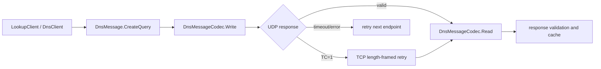

# Technical architecture

## Request flow

## Message model

`DnsMessage` owns a `DnsHeader` and four mutable sections: questions, answers,
authorities, and additionals. `DnsMessageCodec` calculates section counts when
writing and checks that every byte is consumed when reading. This makes malformed
lengths, trailing bytes, invalid labels, and mismatched responses fail early.

## Name compression

The writer maintains a suffix table and emits RFC 1035 pointers when compression is
enabled. The reader follows pointers with bounds checks, a hop limit, and loop
detection. A pointer cannot escape the packet or point into an invalid label.

## Transport and retries

Each attempt gets a linked cancellation token. `Timeout` limits network operations;
caller cancellation is preserved as `OperationCanceledException`. UDP attempts rotate
through configured endpoints. Socket failures and timeouts move to the next attempt;
protocol mismatches are rejected rather than accidentally accepted from another
query. TCP uses RFC 1035's two-byte big-endian frame length.

## Record decoding

The decoder dispatches on `(TYPE, CLASS)` and validates each RDLENGTH before reading
RDATA. Typed models cover common records. All other data is copied into an immutable
`ReadOnlyMemory<byte>` in `RawRecordData`, allowing forward-compatible round trips.

## Extension points

Use `DnsMessage` for custom opcodes, classes, questions, or records. Construct a
`DnsResourceRecord` with a numeric enum cast and `RawRecordData` when experimenting
with a newer extension. Keep network I/O behind `DnsClient.SendAsync` so matching,
timeouts, and truncation behavior remain consistent.
